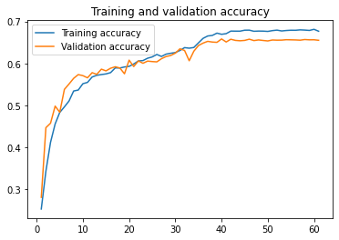
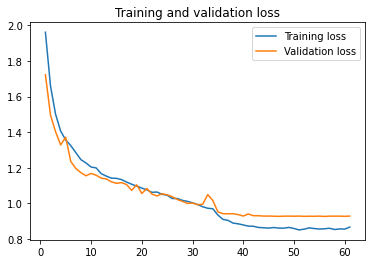
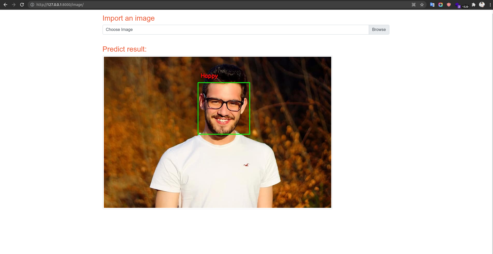
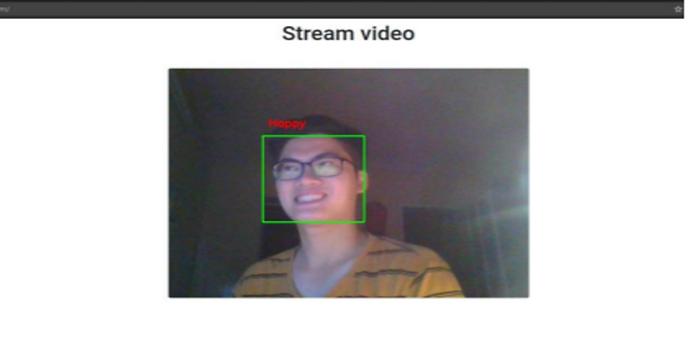

# Facial emotion detection using deep learning

## Introduction

This project aims to classify the emotion on a person's face into one of **seven categories**, using deep convolutional neural networks. The model is trained on the [**FER-2013**](https://www.kaggle.com/deadskull7/fer2013) dataset which was published on International Conference on Machine Learning (ICML). This dataset consists of 35887 grayscale, 48x48 sized face images with **seven emotions** - Angry, Disgust, Fear, Happy, Sad, Surprise, and Neutral.

## Usage

* First, clone the repository and enter the folder

```bash
$ git clone https://github.com/Nukukoricchio/facial-emotion-detection.git
$ cd facial-emotion-detection
```

* To install the required packages, run :

```bash
$ pip install -r requirements.txt
```

* To run development server

```bash
$ python manage.py runserver
```

Open Chrome or FireFox : **127.0.0.1:8000**

## Train model

* This implementation by default detects emotions on all faces in an image or in the webcam feed. The test accuracy reached 66% in 60 epochs.




* If you want to train the model yourself, use:  

```bash
$ unzip files/data.zip -d files
$ python model/train.py
```

## Algorithms

* First, the **haar cascade** method is used to detect faces in an image or each frame of the webcam feed.

* The region of image containing the face is resized to **48x48** and is passed as input to the CNN.

* The network outputs a list of **softmax scores** for the seven classes of emotions.

* The emotion with maximum score is displayed on the screen.

## Example Output




* Video demo (https://bit.ly/3CRDAaX) 